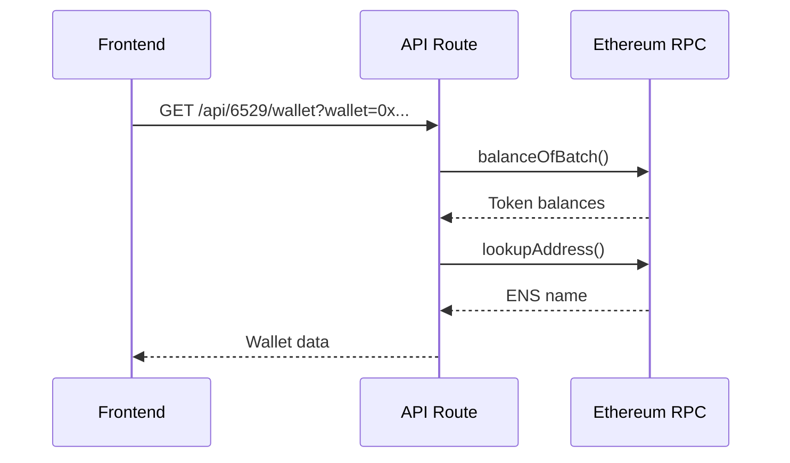

# 6529 Module API Documentation

## Overview
The 6529 module connects to multiple data sources to fetch NFT collection data, wallet holdings, and market information for the 6529 Memes collection. This document provides a comprehensive overview of all API connections and data flows.

## Architecture

```
┌─────────────────────────────────────────────────────────┐
│                     Frontend Components                   │
│  (SixFiveTwoNinePage, WalletTracker, MemesTable)        │
└────────────────┬────────────────────────────────────────┘
                 │
                 ▼
┌─────────────────────────────────────────────────────────┐
│                    Next.js API Routes                     │
│         /api/6529  |  /api/6529/wallet                   │
└────────────────┬────────────────────────────────────────┘
                 │
                 ▼
┌─────────────────────────────────────────────────────────┐
│                    Service Layer                          │
│              6529-service.ts (API Client)                │
└────────────────┬────────────────────────────────────────┘
                 │
                 ▼
┌─────────────────────────────────────────────────────────┐
│                   External APIs                           │
│   Seize.io API  |  Ethereum RPC  |  ENS                 │
└──────────────────────────────────────────────────────────┘
```

## Data Sources

### 1. Seize.io API (Primary NFT Data)
**Base URL:** `https://api.seize.io/api`
**Documentation:** https://api.seize.io/docs/

#### Purpose
- Main source for 6529 Memes collection metadata
- Provides floor prices, offers, and market data
- Handles pagination for fetching all 403 memes

#### Endpoints Used
- `GET /nfts` - Fetch NFT collection data with pagination
- Contract address: `0x33FD426905F149f8376e227d0C9D3340AaD17aF1`

#### Data Retrieved
```typescript
{
  id: number,              // Token ID (1-403)
  name: string,            // Meme name
  artist: string,          // Artist name
  thumbnail: string,       // Image URL
  floor_price: number,     // Current floor price in ETH
  highest_offer: number,   // Highest current offer
  last_sales: Array,       // Recent sales history
  total_supply: number,    // Total supply of this NFT
  unique_owners: number,   // Number of unique holders
  volume_24h: number,      // 24h trading volume
  listed_count: number     // Number currently listed
}
```

### 2. Ethereum RPC (Wallet Holdings)
**Provider:** `https://eth.llamarpc.com` (Public RPC)
**Contract:** `0x33FD426905F149f8376e227d0C9D3340AaD17aF1` (ERC1155)

#### Purpose
- Direct blockchain queries for wallet holdings
- Real-time ownership verification
- ENS name resolution

#### Methods Used
- `balanceOfBatch` - Check ownership of multiple NFTs in one call
- `lookupAddress` - Resolve ENS names for addresses

#### Implementation Details
```typescript
// Batch checking for efficiency
const batchSize = 50; // Check 50 NFTs at once
const totalTokens = 403;

// Uses ERC1155 standard to check ownership
for (let i = 1; i <= totalTokens; i += batchSize) {
  const balances = await contract.balanceOfBatch(addresses, tokenIds);
  // Process ownership data
}
```

## API Routes

### `/api/6529` - Main Collection Endpoint

#### GET Parameters
| Parameter | Type | Description |
|-----------|------|-------------|
| `action` | string | Optional action type |
| `season` | number | Filter by season (1-4) |
| `q` | string | Search query |
| `limit` | number | Limit results |

#### Actions
1. **Default (no action)** - Returns all dashboard data
   ```javascript
   GET /api/6529
   Returns: {
     memes: MemeCard[],      // All 403 memes
     stats: CollectionStats,  // Collection statistics
     collectors: CollectorStats[], // Top collectors
     activity: Activity[]     // Recent activity
   }
   ```

2. **Memes by Season**
   ```javascript
   GET /api/6529?action=memes&season=1
   Returns: { memes: MemeCard[] } // Filtered by season
   ```

3. **Search**
   ```javascript
   GET /api/6529?action=search&q=punk
   Returns: { results: MemeCard[] } // Matching memes
   ```

4. **Stats Only**
   ```javascript
   GET /api/6529?action=stats
   Returns: { stats: CollectionStats }
   ```

### `/api/6529/wallet` - Wallet Holdings Endpoint

#### GET Parameters
| Parameter | Type | Description |
|-----------|------|-------------|
| `wallet` | string | Ethereum address to check |

#### Response
```typescript
{
  address: string,        // Wallet address
  ens: string | null,     // ENS name if available
  ownedMemes: number[],   // Array of owned token IDs
  totalOwned: number,     // Count of owned NFTs
  lastChecked: string     // ISO timestamp
}
```

## Data Flow Examples

### 1. Loading Dashboard
```mermaid
sequenceDiagram
    Frontend->>API Route: GET /api/6529
    API Route->>6529 Service: fetchMemesCollection()
    6529 Service->>Seize.io: GET /nfts (paginated)
    Seize.io-->>6529 Service: NFT data
    6529 Service-->>API Route: Processed memes
    API Route-->>Frontend: Dashboard data
```

### 2. Checking Wallet Holdings


### 3. Calculating Missing NFTs
```javascript
// Frontend calculation in WalletTracker component
const calculateMissingData = (wallets, allMemes) => {
  // 1. Collect all owned NFT IDs from selected wallets
  const ownedIds = new Set();
  wallets.forEach(wallet => {
    wallet.ownedMemes.forEach(id => ownedIds.add(id));
  });
  
  // 2. Filter memes not in owned set
  const missingMemes = allMemes.filter(meme => !ownedIds.has(meme.id));
  
  // 3. Calculate costs
  const totalFloorCost = missingMemes.reduce(
    (sum, meme) => sum + (meme.floor_price || 0), 
    0
  );
  
  return {
    missingMemes,
    missingCount: missingMemes.length,
    totalFloorCost,
    completionPercentage: (ownedIds.size / allMemes.length) * 100
  };
};
```

## Pagination Strategy

The Seize.io API limits responses to 100 items per page. To fetch all 403 memes:

```typescript
async getMemes(): Promise<MemeCard[]> {
  const allMemes: MemeCard[] = [];
  let page = 1;
  const pageSize = 100;
  let hasMore = true;

  while (hasMore && allMemes.length < 1000) {
    const response = await fetch(`/nfts?page=${page}&page_size=${pageSize}`);
    
    if (response.data && response.data.length === pageSize) {
      allMemes.push(...response.data);
      page++;
    } else {
      hasMore = false;
    }
  }
  
  return allMemes;
}
```

## Local Storage Usage

The module uses browser localStorage for:

1. **Wallet Management** (`6529_wallets`)
   ```javascript
   [
     {
       address: "0x...",
       ens: "vitalik.eth",
       ownedMemes: [1, 5, 42, 100],
       lastChecked: "2024-01-01T00:00:00Z"
     }
   ]
   ```

2. **Selected Wallets** (`6529_selected_wallets`)
   ```javascript
   ["0xAddress1", "0xAddress2"] // Currently selected for analysis
   ```

## Error Handling

### API Failures
- Seize.io API failures return empty arrays (no mock data)
- RPC failures are caught per batch, allowing partial results
- ENS failures are non-blocking (returns null)

### Rate Limiting
- Batch size of 50 for blockchain queries
- Pagination respects API limits
- No caching implemented (real-time data)

## Performance Optimizations

1. **Parallel Requests**
   ```javascript
   const [memes, stats, collectors, activity] = await Promise.all([
     fetchMemesCollection(),
     fetchCollectionStats(),
     fetchTopCollectors(),
     fetchRecentActivity()
   ]);
   ```

2. **Batch Processing**
   - ERC1155 `balanceOfBatch` for efficient ownership checks
   - 50 NFTs checked per RPC call

3. **Image Optimization**
   - Uses thumbnails when available
   - Lazy loading with `loading="lazy"`
   - Async decoding with `decoding="async"`

## Season Mapping

Token IDs are mapped to seasons:
- Season 1: IDs 1-100
- Season 2: IDs 101-200
- Season 3: IDs 201-300
- Season 4: IDs 301-400
- Season 5: IDs 401+ (future)

## Contract Details

**6529 Memes Contract**
- Address: `0x33FD426905F149f8376e227d0C9D3340AaD17aF1`
- Type: ERC1155
- Network: Ethereum Mainnet
- Total Supply: 403 unique NFTs

## Future Enhancements

1. **Caching Layer**
   - Redis/memory cache for collection data
   - 5-minute TTL for price data
   - 1-minute TTL for wallet data

2. **WebSocket Support**
   - Real-time price updates
   - Live sales notifications

3. **Additional APIs**
   - OpenSea API integration (requires API key)
   - Alchemy/Infura for reliable RPC
   - 6529 official API (when available)

4. **Analytics**
   - Historical price tracking
   - Portfolio performance metrics
   - Rarity rankings

## Security Considerations

1. **No Private Keys** - Only public data queries
2. **Input Validation** - Address validation for wallet queries
3. **Rate Limiting** - Respects API limits
4. **Error Boundaries** - Graceful failure handling
5. **CORS** - Proper headers for API routes

## Testing

### Manual Testing Checklist
- [ ] Load all 403 memes successfully
- [ ] Filter by season (1-4)
- [ ] Search by name/artist
- [ ] Add/remove wallets
- [ ] Check wallet holdings
- [ ] Calculate missing NFTs
- [ ] Export functionality
- [ ] Mobile responsiveness

### API Testing
```bash
# Test main endpoint
curl http://localhost:7000/api/6529

# Test wallet endpoint
curl http://localhost:7000/api/6529/wallet?wallet=0x...

# Test search
curl http://localhost:7000/api/6529?action=search&q=punk

# Test season filter
curl http://localhost:7000/api/6529?action=memes&season=1
```